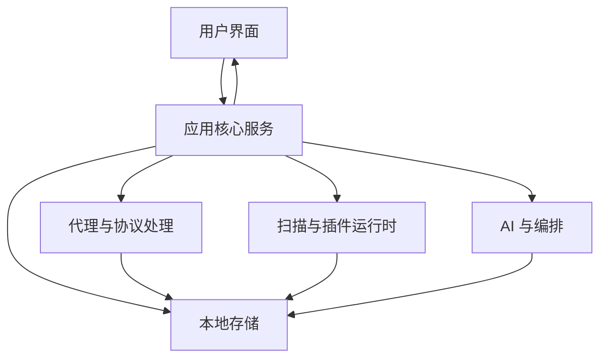

# 架构概览

本文面向需要了解 FlowMind **产品形态**的读者，仅描述能力分层与数据流向，**不包含**源码路径、模块命名、接口契约或数据库设计等实现细节（此类信息属于商业机密，不向公开文档披露）。

## 产品定位

FlowMind 是一款桌面端应用安全工作台，在单进程内集成：

- **流量代理与抓包**：HTTP/HTTPS/WebSocket
- **分析与操作**：转发、拦截、重放、模糊测试
- **安全检测**：内置规则 + 可扩展扫描插件
- **AI 辅助**：对话、工具调用、知识库与项目上下文
- **成果管理**：项目隔离、发现汇总、报告导出

所有业务数据默认保存在本机，不依赖云端即可完成日常工作流。

## 逻辑分层（概念）

| 层次 | 职责 |
|------|------|
| 用户界面 | 展示流量、发现、配置与 AI 交互；不包含与后端重复的业务规则 |
| 应用核心 | 编排各子系统、权限与项目上下文、对外提供统一能力 |
| 代理与协议 | 监听、MITM、连接与报文解析 |
| 本地存储 | 流量、发现、配置、会话等持久化 |
| 扫描与插件 | 内置规则 + WASM / 声明式插件扩展 |
| AI 与编排 | 多模型接入、工具/MCP、记忆与知识检索 |

## 数据与隐私

- 流量、发现、AI 会话等默认写入**本地数据库**，由用户控制保留与清理。
- 证书、配置、插件工作区位于应用数据目录（可在 **设置 → 通用** 查看路径）。
- 向外部 LLM 或 MCP 发送的内容取决于用户在 AI 设置中的配置；敏感环境请使用本地模型或企业网关。

## 扩展方式

对外公开的实现级扩展文档**仅限扫描插件**：

- [WASM 插件](./plugins/wasm.md)
- [声明式插件](./plugins/declarative.md)

插件运行在受控运行时内，通过文档约定的输入/输出与宿主交互，无需了解宿主内部源码。

## 进一步阅读

- [开发者概览](./index.md)
- [插件开发](./plugins/wasm.md)
- [用户指南](../guide/)

::: info 维护者与授权贡献者
如需内部架构、IPC、数据模型等文档，请通过授权渠道向项目维护团队索取，勿在公开文档或 Issue 中要求披露实现细节。
:::
