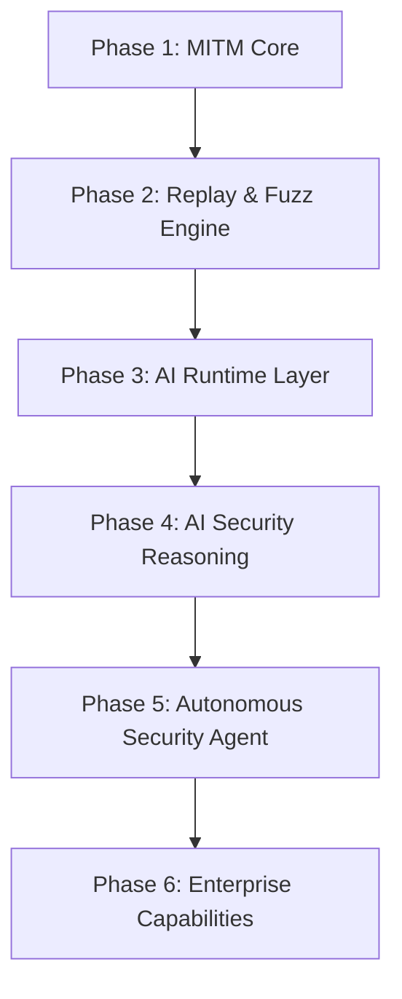

# 路线图

FlowMind 的长期目标是成为 AI-Native Application Security Platform。本文档描述产品的阶段规划与发展方向。

## 产品方向

FlowMind 不仅仅是一个 MITM 代理或传统安全工具替代品，而是逐步演进到：

- AI-Native Application Security Platform
- AI Security Workbench

路线图的重点将转向：

1. 更强的上下文组织能力
2. 更强的 Replay / Fuzz 能力
3. 更强的 AI 推理与建议能力
4. 更强的攻击链和工作流理解能力

## 当前基线 (v0.3.0)

当前版本已具备的主要能力：

- ✅ 内嵌 MITM 代理（HTTP / HTTPS / WebSocket 捕获）
- ✅ 请求拦截器（Hold / Modify / Drop）
- ✅ 流量持久化与实时事件
- ✅ 项目管理与日志查看
- ✅ Repeater（原始 + 结构化、重发历史）
- ✅ Fuzzer（多策略、并发/限速/取消）
- ✅ 被动扫描 + WASM / 声明式工作区插件
- ✅ AI 子系统：多 Provider 聊天、Tool Calling、MCP、知识库/RAG、安全记忆、攻击图
- ✅ JSON / PDF 报告导出与素材剪藏
- ✅ 离线许可授权体系

## 路线图总览

## Phase 1: MITM Core

**状态：✅ 已完成**

建立稳定的代理、证书、WebSocket、流量存储与事件推送能力。

## Phase 2: Replay & Fuzz Engine

**状态：✅ 已完成**

构建请求重放和模糊测试能力，支持多策略与并发控制。

## Phase 3: AI Runtime Layer

**状态：✅ 基本完成**

建立 AI 运行时层，支持多 Provider、工具调用、知识库和记忆。

## Phase 4: AI Security Reasoning

**状态：🔄 进行中**

将 AI 能力应用于安全推理，提供稳定的用户流程：

- API Workflow Discovery（API 工作流发现）
- Attack Graph（攻击图谱）
- AI Findings（AI 安全发现）
- Attack Path Suggestions（攻击路径建议）
- Risk Propagation（风险传播）

## Phase 5: Autonomous Security Agent

**状态：⬜ 规划中**

构建自治安全代理，支持自动重放、模糊测试、攻击链与漏洞验证等任务。

## Phase 6: Enterprise Capabilities

**状态：⬜ 规划中**

提供企业级协作与管理能力：团队协作、共享工作区、审计日志、权限管理与 SSO 等。

## 优先级视图

| 层级 | 重点 | 时间线 |
|------|------|--------|
| MVP / P0 | 核心功能稳定 | 已完成 |
| P1 | AI 能力完善 | 近期 |
| P2 | Phase 4 用户流程补全 | 中期 |
| P3 | Phase 5 自治代理 | 远期 |
| P4 | Phase 6 企业能力 | 更远期 |

## 参与贡献

如果您对路线图中的某个方向感兴趣，欢迎：

- 在 [文档仓库 Issues](https://github.com/gougu-security/flowmind-docs/issues) 讨论文档改进
- 提交 Pull Request 改进公开文档或插件示例
- 在产品仓库的 Discussions 中分享想法

## 相关链接

- [贡献指南](./contributing.md)
- [架构概览](./architecture.md)
- [FlowMind 产品仓库](https://github.com/gougu-security/flowmind)
