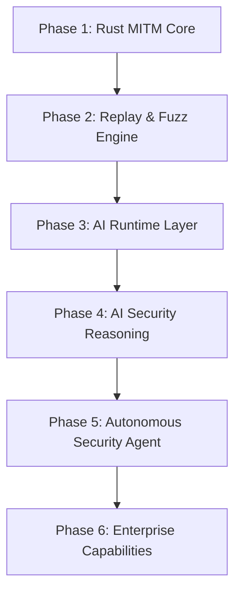

# 路线图

FlowMind 的长期目标是成为 AI-Native Application Security Platform。本文档描述项目的阶段规划和发展方向。

## 产品方向

FlowMind 不仅仅是一个：

- MITM proxy
- Burp alternative

而是逐步演进到：

- AI-Native Application Security Platform
- AI Security Workbench

这意味着路线图的重点会逐步转向：

1. 更强的上下文组织能力
2. 更强的 Replay / Fuzz 能力
3. 更强的 AI 推理与建议能力
4. 更强的攻击链和工作流理解能力

## 当前基线 (v0.3.0)

当前代码已具备的能力：

- ✅ Rust 内嵌 MITM 代理（HTTP / HTTPS / WebSocket 捕获）
- ✅ 请求拦截器（Hold / Modify / Drop）
- ✅ Flow 持久化与事件回推
- ✅ 项目管理与日志查看
- ✅ Repeater（原始 + 结构化、重发历史）
- ✅ Fuzzer（单条 HTTP、多策略、并发/限速/取消）
- ✅ 被动扫描 + WASM / 声明式工作区插件
- ✅ AI 子系统：多 Provider 聊天、Tool Calling、MCP、知识库/RAG、安全记忆、攻击图
- ✅ JSON / PDF 报告导出与素材剪藏
- ✅ 离线许可授权体系

## 路线图总览

## Phase 1: Rust MITM Core

**状态：✅ 已完成**

### 目标

把系统底座做扎实，让代理、证书、WebSocket、Flow Pipeline、存储和事件流成为稳定基础。

### 已完成能力

- HTTPS MITM
- WebSocket Bridge
- Flow Pipeline
- Store & Event 基础能力

## Phase 2: Replay & Fuzz Engine

**状态：✅ 已完成**

### 目标

构建强大的请求重放和模糊测试能力。

### 已完成能力

- 请求重放（原始 + 结构化）
- 模糊测试引擎（多策略、并发控制）
- IDOR、Auth Strip、Header 词表等策略

## Phase 3: AI Runtime Layer

**状态：✅ 基本完成**

### 目标

建立 AI 运行时层，支持多 Provider、工具调用、知识库和记忆。

### 已完成能力

- 多 Provider 聊天（OpenAI、Anthropic、Gemini 等）
- Tool Calling（内置工具、记忆工具、Agent 工具）
- MCP 协议支持
- 知识库 / RAG
- 安全记忆系统
- 攻击图谱

### 已知缺口

- 编排开关在流式主链路未生效
- 自治 Replay/Fuzz 工具未注册
- 记忆摄入未闭环

## Phase 4: AI Security Reasoning

**状态：🔄 进行中**

### 目标

将 AI 能力应用于安全推理，提供稳定的用户流程。

### 规划能力

- API Workflow Discovery（API 工作流发现）
- Attack Graph（攻击图谱）
- AI Findings（AI 安全发现）
- Attack Path Suggestions（攻击路径建议）
- Risk Propagation（风险传播）

### 当前进展

- ✅ 工作流发现图（AI 助手「工作流」Tab）
- ✅ 扫描器「工作流扫描」「攻击路径建议」按钮
- ✅ 攻击图集成风险传播/攻击面
- 🔄 前端入口补全中

## Phase 5: Autonomous Security Agent

**状态：⬜ 规划中**

### 目标

构建自治安全代理，能够自动执行安全测试任务。

### 规划能力

- 自治重放（自动 Token 刷新、会话管理）
- 自治 Fuzz（自动策略选择、Payload 生成）
- 攻击链自动化
- 漏洞验证自动化

### 技术方向

- Agent 编排框架
- 工具链集成
- 上下文管理
- 结果评估

## Phase 6: Enterprise Capabilities

**状态：⬜ 规划中**

### 目标

提供企业级协作和管理能力。

### 规划能力

- 团队协作
- 共享工作区
- 完整报告体系
- 审计日志
- 权限管理
- SSO 集成

## 优先级视图

| 层级 | 重点 | 时间线 |
|------|------|--------|
| MVP / P0 | 核心功能稳定 | 已完成 |
| P1 | AI 接线缺口修复 | 近期 |
| P2 | Phase 4 用户流程补全 | 中期 |
| P3 | Phase 5 自治代理 | 远期 |
| P4 | Phase 6 企业能力 | 更远期 |

## 近期重点

### AI 接线缺口修复

1. 编排开关在流式主链路生效
2. Replay/Fuzz 工具注册
3. 记忆摄入闭环
4. Planner 死循环消除

### Phase 4 用户流程补全

1. 工作流发现 UI 完善
2. 攻击路径建议入口
3. 风险传播展示
4. Finding 项目隔离

## 参与贡献

如果您对路线图中的某个方向感兴趣，欢迎：

- 提交 Issue 讨论设计
- 提交 Pull Request 实现功能
- 在 Discussions 中分享想法

## 相关文档

- [需求文档](https://github.com/G3G4X5X6/mitm-scanner/blob/main/docs/requirements.md) - 当前实现状态
- [设计文档](https://github.com/G3G4X5X6/mitm-scanner/blob/main/docs/design.md) - 架构设计
- [AI 架构](https://github.com/G3G4X5X6/mitm-scanner/blob/main/docs/ai/architecture.md) - AI 子系统详细设计
- [AI 愿景](https://github.com/G3G4X5X6/mitm-scanner/blob/main/docs/ai/vision.md) - AI 远期愿景
