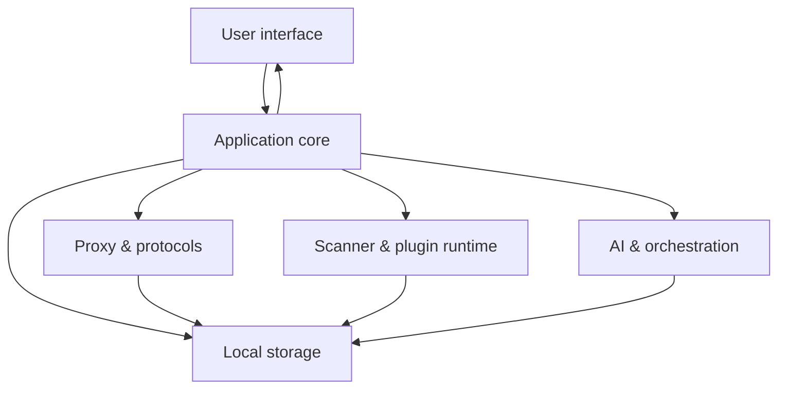

# Architecture Overview

This page describes FlowMind at a **product level** only: capability layers and data flow. It does **not** include source paths, module names, IPC contracts, or database design—those details are confidential and are not published in public documentation.

## Product scope

FlowMind is a desktop application security workbench that integrates in a single process:

- **Traffic proxy & capture**: HTTP/HTTPS/WebSocket
- **Analysis & actions**: forward, intercept, replay, fuzz
- **Security testing**: built-in rules + extensible scan plugins
- **AI assistance**: chat, tools, knowledge base, project context
- **Deliverables**: project isolation, findings, report export

Core workflows run locally without requiring cloud services.

## Logical layers (conceptual)

| Layer | Role |
|-------|------|
| UI | Presents traffic, findings, settings, AI; no duplicated business rules |
| Core | Orchestrates subsystems, entitlements, project context |
| Proxy | Listen, MITM, connection and message handling |
| Storage | Flows, findings, config, sessions |
| Scanner & plugins | Built-in rules + WASM / declarative extensions |
| AI | Multi-provider chat, tools/MCP, memory and RAG |

## Data & privacy

- Flows, findings, AI sessions, etc. are stored **locally** by default.
- Certificates, config, and plugin workspaces live under the app data directory (**Settings → General**).
- Data sent to external LLMs or MCP depends on AI settings; use local models or enterprise gateways in sensitive environments.

## Extension model

Public implementation-level documentation is **limited to scan plugins**:

- [WASM plugins](./plugins/wasm.md)
- [Declarative plugins](./plugins/declarative.md)

Plugins run in a controlled runtime and interact through documented inputs/outputs without requiring host source access.

## See also

- [Developer overview](./index.md)
- [Plugin development](./plugins/wasm.md)
- [User guide](../guide/)

::: info Maintainers & authorized contributors
Internal architecture, IPC, and data model docs are available through authorized channels only. Please do not request implementation details in public issues or docs.
:::
