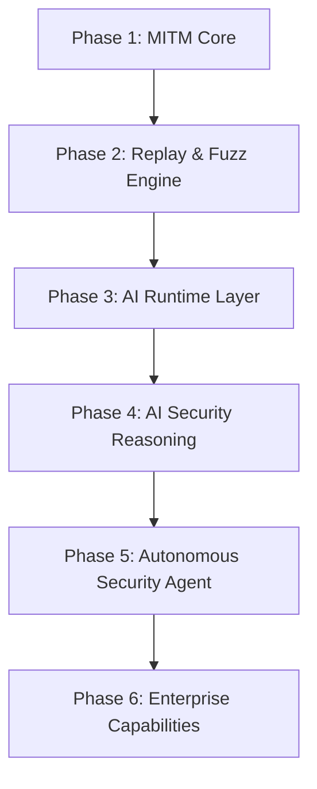

# Roadmap

FlowMind aims to become an AI-Native Application Security Platform. This document outlines product phases and direction.

## Product Direction

FlowMind is evolving beyond a traditional MITM proxy or security tool replacement toward:

- AI-Native Application Security Platform
- AI Security Workbench

Key focus areas:

1. Stronger context organization
2. Stronger replay and fuzz capabilities
3. Stronger AI reasoning and recommendations
4. Stronger attack-chain and workflow understanding

## Current Baseline (v0.3.0)

Major capabilities in the current release:

- ✅ Embedded MITM proxy (HTTP / HTTPS / WebSocket capture)
- ✅ Request interceptor (Hold / Modify / Drop)
- ✅ Traffic persistence and real-time events
- ✅ Project management and log viewing
- ✅ Repeater (raw + structured, replay history)
- ✅ Fuzzer (multi-strategy, concurrency/rate limit/cancel)
- ✅ Passive scanning + WASM / declarative workspace plugins
- ✅ AI subsystem: multi-provider chat, tool calling, MCP, knowledge base/RAG, security memory, attack graph
- ✅ JSON / PDF report export and content clipping
- ✅ Offline license and activation

## Roadmap Overview

## Phase 1: MITM Core

**Status: ✅ Complete**

Stable proxy, certificates, WebSocket, traffic storage, and event delivery.

## Phase 2: Replay & Fuzz Engine

**Status: ✅ Complete**

Request replay and fuzzing with multiple strategies and concurrency control.

## Phase 3: AI Runtime Layer

**Status: ✅ Mostly complete**

AI runtime with multi-provider support, tool calling, knowledge base, and memory.

## Phase 4: AI Security Reasoning

**Status: 🔄 In progress**

Apply AI to security reasoning with stable user workflows:

- API workflow discovery
- Attack graph
- AI findings
- Attack path suggestions
- Risk propagation

## Phase 5: Autonomous Security Agent

**Status: ⬜ Planned**

Autonomous agents for replay, fuzzing, attack chains, and vulnerability validation.

## Phase 6: Enterprise Capabilities

**Status: ⬜ Planned**

Team collaboration, shared workspaces, audit logs, access control, and SSO.

## Priority View

| Tier | Focus | Timeline |
|------|-------|----------|
| MVP / P0 | Core stability | Done |
| P1 | AI capability polish | Near term |
| P2 | Phase 4 user flows | Mid term |
| P3 | Phase 5 autonomous agent | Long term |
| P4 | Phase 6 enterprise | Further out |

## Contributing

Interested in a roadmap item?

- Open an [issue in the docs repo](https://github.com/gougu-security/flowmind-docs/issues) for documentation improvements
- Submit a PR for public docs or plugin examples
- Share ideas in product Discussions

## Related Links

- [Contributing Guide](./contributing.md)
- [Architecture Overview](./architecture.md)
- [FlowMind product repository](https://github.com/gougu-security/flowmind)
