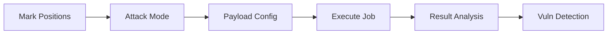

# Fuzzer

The Fuzzer is a full-featured HTTP/WebSocket fuzz testing engine with multi-position marking, multiple attack modes, rich payload generators, vulnerability detection, and anomaly analysis.

## Overview

- **Multi-Position Marking**: URL, path, query params, headers, cookies, body, JSONPath, XMLPath, and raw marker positions
- **Attack Modes**: Sniper, Battering Ram, Pitchfork, Cluster Bomb (Burp Intruder compatible)
- **Payload Generators**: Simple list, number range, random data, wordlist reference, variable templates
- **Encoder Chain**: Base64, Hex, URL Encode, Double URL Encode, Unicode, JWT
- **Vulnerability Packs**: Built-in SQLi, XSS, SSTI, Path Traversal, SSRF payloads
- **Anomaly Detection**: Auto-detect server errors, stack traces, login success indicators
- **Wordlist Management**: Built-in categories + custom wordlists, file import, SecLists download
- **Auth Profiles**: OAuth token auto-refresh and other auth schemes
- **WebSocket Fuzzing**: Frame mutation testing for WebSocket endpoints
- **Sequence Fuzzing**: Multi-step API workflow fuzz testing
- **OpenAPI Import**: Generate requests from OpenAPI specs
- **Script Extension**: Pre/post processing scripts in Rhai

## Interface

Fuzzer sessions are managed in tabs:



## Position Marking

### Auto Detection

After pasting a raw HTTP request, the fuzzer automatically detects mutable positions:

| Position Type | Description | Example |
|---------------|-------------|---------|
| URL | Full URL | `https://target.com/api` |
| Path | URL path segment | `/api/users/123` |
| Query | Query parameter value | `?id=123` |
| Header | Header value | `Authorization: Bearer xxx` |
| Cookie | Cookie value | `session=abc123` |
| Body | Body content | `{"userId": 123}` |
| JSONPath | JSON field path | `$.user.id` |
| XMLPath | XML node path | `/root/user/id` |

### Manual Marking

Use `§` markers in the request editor to define custom positions:

```http
POST /api/users/§123§ HTTP/1.1
Host: target.com
Authorization: Bearer §token§
X-User-Id: §456§

{"id":§789§}
```

Each `§` marker becomes an independently configurable position.

## Attack Modes

| Mode | Description | Case Count |
|------|-------------|------------|
| Sniper | Replace one position at a time | positions × payloads per position |
| Battering Ram | All positions use same payload simultaneously | payload count |
| Pitchfork | Each position uses different payload set, parallel by index | max payload set length |
| Cluster Bomb | Cartesian product across all positions | payloads per position multiplied |

## Payload Configuration

### Payload Generators

| Generator | Description |
|-----------|-------------|
| Simple List | Manually entered string list |
| Number Range | Number range (start, end, step) |
| Random String | Fixed-length random string |
| Random UUID | Random UUID v4 |
| Random Int | Random integer in range |
| Random Email | Random email address |
| Random IP | Random IP address |
| Random MAC | Random MAC address |
| Random Date | Random date string |
| Random Timestamp | Random timestamp |
| Wordlist Reference | Reference built-in or custom wordlist |
| Variable | Variable template (e.g. `{{uuid}}`, `{{int}}`) |

### Encoders

Each payload set can configure an encoder chain:

| Encoder | Description |
|---------|-------------|
| None | No encoding |
| Base64 | Base64 encode |
| Hex | Hex encode |
| URL Encode | URL percent-encode |
| Double URL Encode | Double URL encode |
| Unicode | Unicode escape |
| JWT | JWT format encoding |

### Wordlist Management

Built-in security testing wordlists covering common vulnerability scenarios:

- **SQL Injection**: SQL keywords, error-based payloads, time-based blind
- **XSS**: Reflected, stored, DOM-based
- **Path Traversal**: Unix/Windows traversal patterns
- **SSRF**: Internal addresses, cloud metadata endpoints
- **Command Injection**: OS command injection
- **Auth Bypass**: Common tokens, default credentials
- **File Upload**: WebShell, MIME type bypass

Features:
1. Import custom wordlists (TXT files)
2. Manage wordlists by category
3. Download SecLists public wordlists
4. Preview wordlist content

## Vulnerability Packs

Pre-configured attack payload packs for one-click selection:

| Pack ID | Name | Sample Payloads |
|---------|------|-----------------|
| `sqli` | SQL Injection | `' OR '1'='1`, `1; DROP TABLE users--` |
| `xss` | Cross-Site Scripting | `<script>alert(1)</script>`, `` |
| `ssti` | Server-Side Template Injection | `{{7*7}}`, `${7*7}`, `<%= 7*7 %>` |
| `path_traversal` | Path Traversal | `../../../etc/passwd`, `..\..\..\windows\win.ini` |
| `ssrf` | SSRF | `http://127.0.0.1`, `http://169.254.169.254` |
| `cmd_injection` | Command Injection | `;id`, `\|whoami`, `$(cat /etc/passwd)` |
| `idor` | IDOR Numeric Mutation | Adjacent ID enumeration |
| `auth_strip` | Auth Stripping | Remove Authorization/Cookie headers |

## Anomaly Detection

Each response is automatically analyzed for anomalies:

| Anomaly Type | Severity | Description |
|-------------|----------|-------------|
| Server Error | High | HTTP 5xx status code |
| SQL Error | High | Database error messages in response |
| Stack Trace | Medium | Java/Python/PHP/.NET stack traces |
| Login Success | Medium | Response indicates auth bypass |
| Status Change | Low | Different status code from baseline |
| Length Change | Low | Response length differs beyond threshold |
| Keyword Match | Low | Response contains configured keyword |

Result filtering:
- **Show anomalies only**: Display only flagged results
- **Show diffs only**: Display only results differing from baseline
- **Custom filters**: Combined filtering by status code, length, keywords

## Execution Config

| Option | Default | Description |
|--------|---------|-------------|
| Concurrency | 3 | Concurrent requests (max 256) |
| Request Interval | 0ms | Fixed interval between requests |
| Rate Limit | 0/s | Max requests per second |
| Random Delay | 0ms | Max random delay between requests |
| Timeout | 30s | Single request timeout |
| Max Retries | 1 | Retry on failure |
| Retry 5xx | No | Retry on server errors |
| Baseline First | Yes | Send original request as baseline |
| Max Cases | 200 | Max generated test cases |
| Compare Keyword | | Response body keyword comparison |

## Auth Profiles

Configure auth schemes to automatically maintain credentials during fuzzing:

| Type | Description |
|------|-------------|
| OAuth 2.0 | Auto-refresh tokens |
| API Key | Static API key |
| Basic Auth | Username/password |
| Cookie | Session cookie |

## WebSocket Fuzzing

Fuzz WebSocket endpoints:

1. Configure WebSocket URL (`ws://` or `wss://`)
2. Set handshake headers (optional)
3. Define baseline text frame (can include `§` markers)
4. Execute mutations
5. Analyze response frames

## Sequence Fuzzing

Fuzz multi-step API workflows:

1. Import multi-step requests from sequences
2. Select target steps for fuzzing
3. Configure mutation positions and payloads per step
4. Execute step-by-step
5. Supports prefix reduction strategy per step

## OpenAPI Import

Import from OpenAPI 2.0/3.0 specification files:

1. Upload or paste OpenAPI JSON/YAML
2. Auto-parse all API endpoints
3. Select target endpoints to generate fuzz requests
4. Auto-fill parameter example values

## Result Analysis

### Results List

| Field | Description |
|-------|-------------|
| Case ID | Test case number |
| Label | Case description label |
| Status Code | HTTP response status code |
| Response Length | Response body size (bytes) |
| Duration | Request processing time (ms) |
| Diff Flags | Difference dimensions from baseline |
| Anomaly Flags | Detected anomaly types |

### Diff Comparison

Multi-dimensional diff calculated against baseline:

- Status code change
- Response length change
- Body hash difference
- Header difference
- JSON structure diff

### Result Actions

- **View Details**: Full request/response
- **Send to Repeater**: Further verify suspicious requests
- **Create Finding**: Record vulnerability as security finding
- **Export**: JSON/CSV format

## Script Extension

### Pre Script

Rhai script executed before each request, useful for:

- Dynamic request data generation
- Signature calculation
- Conditional logic

### Post Script

Rhai script executed after each response, useful for:

- Custom anomaly detection
- Response data extraction
- Dynamic token updates

## Use Cases

### Parameter Injection Testing

```
1. Mark query params, body fields, etc.
2. Select SQL injection detection pack as payload
3. Sniper mode tests one position at a time
4. Filter anomaly results for verification
```

### Auth Bypass Testing

```
1. Mark Authorization or Cookie headers
2. Use auth stripping pack
3. Configure "login success" keyword filter
4. Filter non-401/403 responses
```

### Multi-Step Workflow Testing

```
1. Import API workflow from sequences
2. Select sensitive steps as fuzz targets
3. Configure mutation strategy per step
4. Execute sequence fuzz
5. Analyze prefix dependencies and response changes
```

## Notes

::: warning Responsible Use
- Only test authorized targets
- Control request rate to avoid target overload
- Comply with applicable laws and regulations
:::

::: tip Performance
- Start with 3-5 concurrency, adjust based on target response speed
- Use filtering to focus on anomaly results for large case sets
- WebSocket and sequence fuzzing consume more resources
:::
