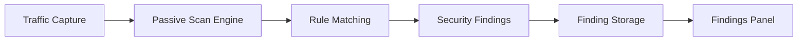
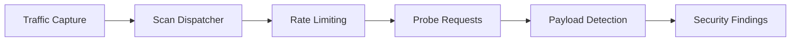

# Plugins

Plugins is the security detection core of FlowMind. All scan rules and tag scripts are managed here. The Plugins page has three tabs: **Rules** (passive scanning), **Scan** (active scanning), and **Tags** (request tagging scripts).


## Overview

- **Rule Management**: View, create, edit, and delete passive scan rule scripts
- **Scan Management**: View, create, edit, and delete active scan rule scripts
- **Tag Scripts**: Write Rhai functions to automatically tag requests
- **Hot Reload**: Reload scripts with one click, no restart needed
- **Rule Debugging**: Select a Flow to test rule output
- **Project Configuration**: Enable/disable rules per project

## Page Layout

The Plugins page has three tabs:

| Tab | Description |
|-----|-------------|
| **Rules** | Passive scan scripts (`plugins/scanner/passive/`) |
| **Scan** | Active scan scripts (`plugins/scanner/active/`) |
| **Tags** | Tag scripts |

## Rules (Passive Scanning)

Manage passive scanning rules stored as `.rhai` files in `plugins/scanner/passive/`.

### Rule List

- **Built-in Rules**: Compiled into the binary, auto-extracted on first launch, read-only
- **Workspace Rules**: User-created, editable, deletable, renamable
- **Status Indicator**: Shows whether a rule is enabled and its metadata

### Actions

| Action | Description |
|--------|-------------|
| Enable/Disable | Toggle rule status |
| Edit | Open script editor |
| Create | New rule file in workspace |
| Delete | Delete workspace rule |
| Reload | Reload all scripts |
| Debug | Test rule output against a selected Flow |

### Execution Flow



Passive scanning runs automatically during traffic capture. Rules check all HTTP/HTTPS and WebSocket traffic.

### Built-in Rules

28 built-in passive scanning rules, all enabled by default, covering OWASP Top 10 risks.

## Scan (Active Scanning)

Manage active scanning rules stored as `.rhai` files in `plugins/scanner/active/`.

### Execution Flow



Active scanning runs concurrently during traffic capture (disabled by default, must be enabled in project settings).

### Built-in Rules

8 built-in active scanning rules, all disabled by default.

## Tag Scripts

Tag scripts are Rhai functions that automatically tag captured requests.

### Use Cases

- **Endpoint Classification**: Tag API endpoints by URL pattern
- **Sensitive Operations**: Identify requests involving sensitive operations
- **Tech Stack Recognition**: Tag based on response headers
- **Custom Annotations**: Project-specific tagging logic

### Function Format

Tag scripts export a `fn tag(flow)` function that returns an array of strings:

```rust
fn tag(flow) {
    let tags = [];
    if host_url_match(flow, "/api/admin") {
        tags.push("admin");
    }
    if host_url_match(flow, "(?i)(login|auth|token)") {
        tags.push("auth");
    }
    if host_header_absent(flow, "req", "authorization") {
        tags.push("no-auth");
    }
    tags
}
```

## Script Editor

All rules and tag scripts share the same editor with:

- **Syntax Highlighting**: Rhai script highlighting
- **Code Folding**: Fold/unfold code blocks
- **Error Reporting**: Real-time compilation errors
- **Debug Output**: Execution result preview

## Project Configuration

- Go to **Settings → Project Settings** to enable/disable rules
- Active rules are disabled by default
- Rule configuration is per-project

## Viewing Findings

Findings can be viewed through:

- **Status Bar Findings Panel**: Quick access to recent findings
- **Reports Page**: Browse and manage all findings in the **Findings** tab

## Built-in Rules

### Passive Rules (28, all enabled by default)

| Rule ID | Name | Detection | Severity |
|---------|------|-----------|----------|
| `sensitive-data` | Sensitive Data Leak | Phone, ID, email, secrets | High |
| `credit-card` | Credit Card Leak | Visa/MasterCard/Amex numbers | High |
| `transport-http-sensitive` | HTTP Plaintext Sensitive Params | password/token/secret in plaintext | High |
| `transport-hsts-missing` | HSTS Missing | No HSTS header on HTTPS | High |
| `certificate` | Certificate Issues | Self-signed or expired cert | High |
| `sqli-pattern` | SQL Injection Pattern | UNION SELECT, OR 1=1 patterns | High |
| `path-traversal` | Path Traversal | ../ or ..\\ patterns | High |
| `api-key-in-url` | API Key in URL | api_key in query params | High |
| `websocket-ws-sensitive` | WebSocket Plaintext Sensitive Info | password/token in ws:// | High |
| `websocket-ws-plaintext` | WebSocket Plaintext Connection | ws:// protocol | High |
| `cookie-security` | Cookie Security Missing | No HttpOnly/Secure/SameSite | Medium |
| `cors` | Insecure CORS | ACAO: \* + ACAC: true | Medium |
| `csp` | Weak CSP | unsafe-inline, unsafe-eval, \* | Medium |
| `x-frame-options` | X-Frame-Options Missing | Clickjacking risk | Medium |
| `jwt-token` | JWT Token Leak | eyJ-prefixed tokens in body | Medium |
| `stack-trace` | Stack Trace Leak | Debug stack in response | Medium |
| `debug-page` | Debug Page Exposure | Flask debug, PHPInfo, Spring Boot error | Medium |
| `directory-listing` | Directory Listing | Index of / listing | Medium |
| `open-redirect` | Open Redirect | Location to external domain | Medium |
| `host-header-injection` | Host Header Injection | Response reflects Host header | Medium |
| `xss-reflection` | XSS Reflection | Unencoded \<script\> or event handlers | Medium |
| `content-type` | Content-Type Missing | No X-Content-Type-Options | Low |
| `info-leak` | Server Info Leak | Server/X-Powered-By headers | Low |
| `internal-ip` | Internal IP Leak | RFC1918 IP in response | Low |
| `referrer-policy` | Referrer-Policy Missing | No Referrer-Policy header | Low |
| `permissions-policy` | Permissions-Policy Missing | No feature policy header | Low |
| `cache-control` | Cache-Control Missing | Sensitive pages without cache control | Low |
| `x-xss-protection` | X-XSS-Protection Missing | Missing XSS filter header | Low |

### Active Rules (8, all disabled by default)

| Rule ID | Name | Detection Method | Severity |
|---------|------|------------------|----------|
| `active-sqli-error` | SQL Injection (Error) | Append quote payload, detect DB errors | High |
| `active-cmd-injection` | Command Injection | Append echo canary, detect echo | High |
| `active-path-traversal` | Path Traversal | Replace with ../etc/passwd | High |
| `active-ssrf` | SSRF | Inject internal address, detect connection | High |
| `active-xss-reflect` | XSS Reflection | Append unique probe, detect echo | Medium |
| `active-open-redirect` | Open Redirect | Inject external probe domain, detect redirect | Medium |
| `active-ssti` | SSTI | Append arithmetic expression, detect eval result | Medium |
| `active-error-disclosure` | Error Disclosure | Inject malformed input, compare baseline | Low |

## Plugin Development

All scan rules use the **Rhai scripting language**. See:

- [Rhai Script Rule Development](../dev/plugins/rhai.md)
- [Declarative Plugin Development](../dev/plugins/declarative.md)

## Troubleshooting

### Rules Not Triggering

1. Check if rules are enabled in the project
2. Verify the proxy is running and capturing traffic
3. Passive rules trigger automatically; active rules need traffic
4. Check scan logs

### Script Load Failure

1. Check `.rhai` file format and syntax
2. Verify metadata header (`//!`) format
3. Check app logs for compilation errors
4. Click **Reload** to refresh

### Performance Issues

1. Reduce number of enabled rules
2. Return early in scripts to minimize regex
3. Adjust active scan concurrency limits
4. Periodically clean historical Flow data
