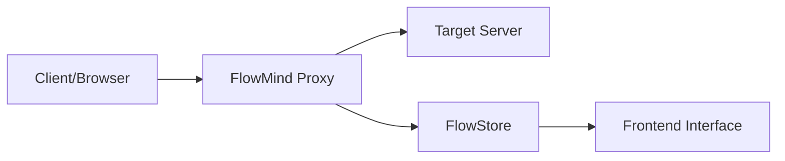

# Proxy Core

FlowMind includes a Rust-based MITM (Man-in-the-Middle) proxy engine that supports HTTP/HTTPS/WebSocket traffic capture.

## Proxy Architecture

## Start & Stop

### Start Proxy

1. Click the **Start Proxy** button in the title bar
2. Proxy starts listening on the configured address and port
3. Status bar shows: `● Proxy Running - 127.0.0.1:8080`

### Health Information

When the proxy is running, the following health metrics are displayed:

| Metric | Description |
|--------|-------------|
| Active Connections | Number of currently active connections |
| Total Requests | Total requests since proxy started |

## Configuration Options

Go to **Settings** → **Proxy Configuration** to adjust:

| Option | Default | Description |
|--------|---------|-------------|
| Listen Address | `127.0.0.1` | IP address the proxy listens on |
| Listen Port | `8080` | Port the proxy listens on |
| Max Request Body Size | `10 MB` | Maximum size of a single request body |
| Max WebSocket Message Size | `1 MB` | Maximum WebSocket message size |

::: tip Port Conflict
If the configured port is already in use, the proxy will automatically try other ports and display the actual port in the status bar.
:::

## HTTPS MITM

### How It Works

1. Client initiates HTTPS connection to proxy
2. Proxy dynamically generates certificate for target domain
3. Proxy establishes TLS connection with client
4. Proxy establishes TLS connection with target server
5. Proxy decrypts, records, and re-encrypts traffic

### CA Certificate Management

| Operation | Description |
|-----------|-------------|
| Export CA Certificate | Export CA certificate as file for client installation |
| Regenerate CA | Generate new CA key pair (old certificate will be invalid) |
| View CA SPKI | Display certificate's SPKI hash for certificate pinning |

## WebSocket Support

FlowMind fully supports WebSocket protocol:

- **Connection Capture**: Automatically identifies WebSocket upgrade requests
- **Message Recording**: Records all WebSocket messages (text/binary)
- **Close Frames**: Records WebSocket connection close information
- **Detail View**: View in Forwarder detail panel's WebSocket tab

## Protocol Support

| Protocol | Status | Notes |
|----------|--------|-------|
| HTTP/1.0 | ✅ Full Support | |
| HTTP/1.1 | ✅ Full Support | |
| HTTPS | ✅ Full Support | Decrypted via MITM |
| WebSocket | ✅ Full Support | Including WSS |
| HTTP/2 | ⚠️ Partial | Currently HTTP/1 path based |

## Troubleshooting

### Proxy Won't Start

1. **Port in use**: Change listen port or close program using the port
2. **Insufficient permissions**: Ports below 1024 need root on Linux/macOS
3. **Firewall blocking**: Check firewall settings

### HTTPS Decryption Fails

1. **CA certificate not installed**: Export and install CA certificate
2. **Certificate pinning**: Target app uses certificate pinning
3. **Mutual TLS**: Client certificate scenarios not supported

### Performance Issues

1. **Many connections**: Adjust max connection configuration
2. **Large files**: Increase request body size limit
3. **Memory usage**: Regularly clean Flow data
