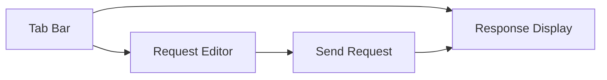

# Repeater

The Repeater is used for replaying historical requests or manually modifying and resending them. It's an important tool for security testing and API debugging.

## Overview

- **Request Replay**: Quick replay based on existing requests
- **Raw Editing**: Directly edit HTTP raw messages
- **Structured Editing**: Visually edit request parts
- **Tab Management**: Save request tabs for repeated testing
- **Replay History**: Auto-record request and response snapshots

## Interface Layout

The Repeater uses a multi-tab layout, with each tab containing independent request editing and response viewing areas:



## Send to Repeater

### From Forwarder

1. Select request in Forwarder list
2. Right-click → **Send to Repeater**
3. Request loads into new tab

### From Fuzzer

1. Select request in Fuzzer results
2. Right-click → **Send to Repeater**

### Manual Creation

1. Click **+** button in tab bar
2. Manually enter request or paste raw HTTP message

## Edit Request

### Raw Mode

Directly edit HTTP raw message:

```http
GET /api/users HTTP/1.1
Host: example.com
Authorization: Bearer token123
Accept: application/json

```

### Structured Mode

Visually edit each part:

| Part | Editable Content |
|------|------------------|
| Request Line | Method, Path, Protocol Version |
| Headers | Add, Modify, Delete headers |
| Body | JSON, Form, Raw content |
| Connection | Host, Port, TLS toggle |

## Send Request

### Basic Send

1. Edit request content
2. Click **Send** button (or `Ctrl/⌘ + Enter`)
3. Response displays in right panel

### Connection Configuration

| Option | Description |
|--------|-------------|
| Host | Target server address |
| Port | Target server port |
| TLS | Whether to use HTTPS |

::: tip
Connection config overrides Host header value, used for testing different environments.
:::

## Response View

### Response Overview

- Status code
- Response size
- Response time

### Response Headers

Complete response header list

### Response Body

Multiple view formats:

- **Pretty**: Formatted display (JSON, XML, etc.)
- **Raw**: Original content
- **Hex**: Hexadecimal view

## Tab Management

### Save Tab

1. Edit request
2. Click **Save** button (or `Ctrl/⌘ + S`)
3. Enter tab name

### Manage Tabs

| Action | Description |
|--------|-------------|
| Rename | Right-click tab → Rename |
| Delete | Right-click tab → Delete |
| Copy | Right-click tab → Copy |
| Reorder | Drag tab to reorder |

## Replay History

Each request send is auto-recorded:

- Send timestamp
- Request content snapshot
- Response result

History allows tracing the testing process and comparing response differences across request variants.

## Request Export

Export Repeater requests to file:

1. Right-click in the tab → **Export**
2. Choose save path
3. Request content saved as raw HTTP message format

## Use Cases

### API Debugging

```
1. Capture API request from Forwarder
2. Send to Repeater
3. Modify request parameters
4. Resend, observe response
5. Repeat until correct
```

### Authentication Testing

```
1. Capture authenticated request
2. Modify Authorization header
3. Test different token permissions
4. Verify authentication robustness
```

### Parameter Tampering

```
1. Capture request with business parameters
2. Modify values (user ID, amount, status, etc.)
3. Observe response changes
4. Identify privilege escalation or logic flaws
```

### Environment Comparison

```
1. Configure different Host values across tabs
2. Compare API response differences between environments
3. Verify environment configuration consistency
```

## Keyboard Shortcuts

| Shortcut | Function |
|----------|----------|
| `Ctrl/⌘ + Enter` | Send request |
| `Ctrl/⌘ + S` | Save tab |
| `Ctrl/⌘ + N` | New tab |
| `Ctrl/⌘ + W` | Close current tab |
