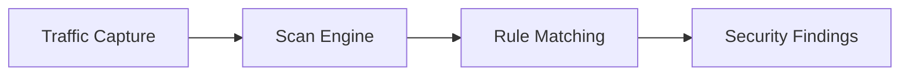

# Scanner

The Scanner provides automated security detection capabilities, identifying potential security issues through rule engines and plugin systems.

## Overview

- **Passive Scanning**: Automatically check captured traffic
- **Built-in Rules**: 9 pre-installed security rules
- **Plugin Extension**: Support WASM and declarative plugins
- **Project Configuration**: Enable/disable rules per project

## Scan Types

### Passive Scanning

Passive scanning triggers automatically when traffic is captured:

Triggers:
- After HTTP/HTTPS request completes
- After WebSocket session ends

### Active Scanning

Active scanning is manually triggered by user:

- Deep scan on selected Flows
- AI-powered security analysis

## Built-in Rules

| Rule ID | Name | Detection | Severity |
|---------|------|-----------|----------|
| `sensitive.info` | Sensitive Info Leak | API Keys, Tokens, Passwords | High |
| `cookie.security` | Cookie Security | Secure, HttpOnly, SameSite | Medium |
| `transport.security` | Transport Security | HTTP plaintext, weak TLS | Medium |
| `info.disclosure` | Info Disclosure | Server versions, internal paths | Low |
| `cors.misconfig` | CORS Misconfig | Overly permissive CORS | Medium |
| `content.type` | Content-Type | Missing or wrong Content-Type | Low |
| `csp.missing` | CSP Missing | Missing Content-Security-Policy | Low |
| `cert.issue` | Certificate Issues | Expired, self-signed certs | Medium |
| `websocket.security` | WebSocket Security | Missing auth, plaintext | Medium |

## Plugin System

### WASM Plugins

WebAssembly-based scanning plugins:

- **Advantages**: High performance, cross-platform, sandboxed
- **Languages**: Rust, C/C++, AssemblyScript
- **Limits**: No filesystem, no network

See [WASM Plugin Development](../dev/plugins/wasm.md)

### Declarative Plugins

YAML/JSON/TOML declared scanning rules:

- **Advantages**: Easy to write, no compilation
- **Suitable**: Simple pattern matching rules
- **Formats**: Multiple config formats

See [Declarative Plugin Development](../dev/plugins/declarative.md)

## Scan Configuration

### Rule Management

Go to **Scanner** → **Configuration**:

1. View all available rules
2. Enable/disable specific rules
3. Save config to current project

### Plugin Management

Go to **Scanner** → **Plugins**:

1. View installed plugins
2. Import new plugins (ZIP or directory)
3. Reload plugins (after modifications)

## View Results

### Finding List

Go to **Scanner** → **Findings**:

| Field | Description |
|-------|-------------|
| Severity | High / Medium / Low / Info |
| Rule Name | Triggered rule or plugin name |
| Description | Security issue description |
| Related Flow | Request that triggered finding |
| Time | Discovery time |

### Finding Details

Click Finding for details:

- **Description**: Detailed security issue
- **Evidence**: Specific content that triggered rule
- **Remediation**: How to fix
- **Related Data**: Related request/response data

## AI-Enhanced Scanning

### AI Security Scan

Use AI for deep Flow analysis:

1. Select Flows to scan
2. Click **AI Scan**
3. AI analyzes request/response content
4. Generate security findings

### Workflow Scan

AI-powered workflow-level scanning:

1. Analyze API call sequences
2. Identify business logic vulnerabilities
3. Generate attack path suggestions

## Best Practices

### Passive Scanning

1. **Keep rules enabled**: Default rules cover common issues
2. **Check Findings regularly**: Process security findings promptly
3. **Project-level config**: Adjust rules per project needs

### Plugin Usage

1. **Start simple**: Use declarative plugins first
2. **Test thoroughly**: Verify plugins in test environment
3. **Consider performance**: WASM plugins perform better
