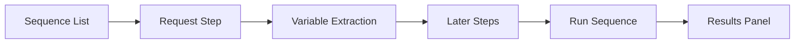

# Sequence

The Sequence tool orchestrates multiple requests and executes them in order, extracting data from one step's response to feed subsequent requests. It's ideal for testing multi-step business logic and complex API workflows.


## Overview

- **Multi-step orchestration**: Chain multiple requests and run them in order
- **Variable extraction**: Pull tokens, IDs, and other data from responses
- **Variable passing**: Inject extracted values into later steps' params, headers, or body
- **Conditional control**: Branch execution based on response results
- **Import & export**: Import requests from Repeater or proxy traffic; export sequences

## Interface Layout

The Sequence editor organizes requests as steps within a sequence:



## Create a Sequence

1. Click **New Sequence** on the Sequence page
2. Enter a name (e.g. "register-login-checkout")
3. Add request steps in business order

### Add Request Steps

- Right-click a request in Forwarder → **Send to Sequence**
- Right-click a Repeater tab → **Send to Sequence**
- Click **+** in the sequence to create manually

## Variable Extraction & Passing

### Extract Variables

Values can be extracted from each step's response:

| Source | Example |
|--------|---------|
| Response header | Session ID from `Set-Cookie` |
| Response body | JSON field such as `data.token` |
| Regex extraction | Custom regex captures |

### Reference Variables

Reference variables in later steps using `{{variable}}` syntax:

```
POST /api/order HTTP/1.1
Host: example.com
Authorization: Bearer {{token}}
Content-Type: application/json

{"productId": 1, "quantity": 2}
```

## Run a Sequence

1. Click **Run** (or `Ctrl/⌘ + Enter`)
2. Requests are sent sequentially in step order
3. Each step's result appears in the results panel

### Run Options

| Option | Description |
|--------|-------------|
| Loop count | Repeat the entire sequence |
| Pause interval | Delay between steps (ms) |
| Stop on failure | Halt execution after a failed step |

## View Results

The results panel shows per step:

- Request and response messages
- Status code and response time
- Extracted variable values
- Execution order and timing

## Import & Export

Sequences can be exported to JSON or imported for reuse. They can also be sent to the [Fuzzer](./fuzzer.md) for multi-step workflow fuzzing.

## Use Cases

### Multi-step Business Flow Testing

```
1. Capture the login request
2. Extract the token from the response
3. Inject the token into subsequent business requests
4. Execute the full business flow in order
5. Verify for privilege escalation or logic flaws
```

### Permission Chain Verification

```
1. Steps cover create → view → modify → delete
2. Compare step outcomes across user roles
3. Identify horizontal/vertical privilege escalation
```

### Environment Switching

```
1. Configure different Host values per environment
2. Run the same sequence in each environment
3. Compare per-step response differences
```

## Keyboard Shortcuts

| Shortcut | Function |
|----------|----------|
| `Ctrl/⌘ + Enter` | Run sequence |
| `Ctrl/⌘ + N` | New sequence |
| `Ctrl/⌘ + S` | Save sequence |
| `Ctrl/⌘ + W` | Close current sequence |
