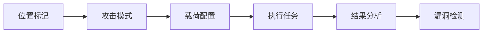

# 模糊器

模糊器是一个功能完整的 HTTP/WebSocket 模糊测试引擎，支持多位置标记、多种攻击模式、丰富的载荷生成器、漏洞检测和异常分析。


## 功能概述

- **多位置标记**：支持 URL、路径、查询参数、请求头、Cookie、请求体、JSONPath、XMLPath 及原始报文标记
- **攻击模式**：Sniper、Battering Ram、Pitchfork、Cluster Bomb（与 Burp Intruder 兼容）
- **载荷生成**：简单列表、数字范围、随机数据、词表引用、变量模板
- **编码链**：Base64、Hex、URL 编码、双次 URL 编码、Unicode、JWT
- **漏洞检测包**：内置 SQL 注入、XSS、SSTI、路径穿越、SSRF 等攻击载荷
- **异常检测**：自动识别服务端错误、堆栈跟踪、登录成功等异常响应
- **词表管理**：内置分类词表 + 自定义词表，支持导入文件和下载 SecLists
- **认证配置**：OAuth Token 自动刷新等认证方案
- **WebSocket 模糊**：支持 WebSocket 帧变异测试
- **序列模糊**：多步骤 API 工作流模糊测试
- **OpenAPI 导入**：从 OpenAPI 规范自动生成请求
- **脚本扩展**：支持 Pre/Post 脚本自定义处理逻辑

## 界面布局

模糊器采用标签页方式管理多个模糊测试会话：



## 位置标记

### 自动探测

粘贴原始 HTTP 请求后，模糊器自动解析以下可变异位置：

| 位置类型 | 说明 | 示例 |
|----------|------|------|
| URL | 完整 URL | `https://target.com/api` |
| Path | URL 路径段 | `/api/users/123` |
| Query | 查询参数值 | `?id=123` |
| Header | 请求头值 | `Authorization: Bearer xxx` |
| Cookie | Cookie 值 | `session=abc123` |
| Body | 请求体内容 | `{"userId": 123}` |
| JSONPath | JSON 字段路径 | `$.user.id` |
| XMLPath | XML 节点路径 | `/root/user/id` |

### 手动标记

在请求编辑器中，使用 `§` 符号标记自定义变异位置：

```http
POST /api/users/§123§ HTTP/1.1
Host: target.com
Authorization: Bearer §token§
X-User-Id: §456§

{"id":§789§}
```

每个 `§` 标记自动成为一个可独立配置载荷的变异位置。

## 攻击模式

| 模式 | 说明 | 用例数 |
|------|------|--------|
| Sniper | 每次替换一个位置，其他位置用原始值 | 位置数 × 每位置载荷数 |
| Battering Ram | 所有位置同时使用相同的载荷值 | 载荷数 |
| Pitchfork | 每个位置使用不同的载荷集，按索引并行 | 载荷集最大长度 |
| Cluster Bomb | 所有位置载荷集的笛卡尔积 | 各位置载荷数相乘 |

## 载荷配置

### 载荷生成器

| 生成器 | 说明 |
|--------|------|
| Simple List | 手动输入的字符串列表 |
| Number Range | 数字范围（起始、结束、步长） |
| Random String | 随机定长字符串 |
| Random UUID | 随机 UUID v4 |
| Random Int | 指定范围内的随机整数 |
| Random Email | 随机邮箱地址 |
| Random IP | 随机 IP 地址 |
| Random MAC | 随机 MAC 地址 |
| Random Date | 随机日期字符串 |
| Random Timestamp | 随机时间戳 |
| Wordlist Reference | 引用内置或自定义词表 |
| Variable | 变量模板（如 `{{uuid}}`、`{{int}}`） |

### 编码器

每个载荷集可配置编码链，按顺序依次编码：

| 编码器 | 说明 |
|--------|------|
| None | 不编码 |
| Base64 | Base64 编码 |
| Hex | 十六进制编码 |
| URL Encode | URL 编码 |
| Double URL Encode | 双次 URL 编码 |
| Unicode | Unicode 转义 |
| JWT | JWT 格式编码 |

### 词表管理

内置大量安全测试词表，涵盖常见漏洞场景：

- **SQL 注入**：SQL 关键字、报错 payload、时间盲注
- **XSS 攻击**：反射型、存储型、DOM 型
- **路径穿越**：Unix/Windows 穿越模式
- **SSRF**：内网地址、云元数据端点
- **命令注入**：OS 命令拼接
- **认证绕过**：常见 Token、默认凭据
- **文件上传**：WebShell、MIME 类型绕过

支持：
1. 导入自定义词表（TXT 文件）
2. 按分类管理词表
3. 下载 SecLists 公共词表
4. 预览词表内容

## 漏洞检测包

内置预配置的漏洞检测载荷包，一键选择即可执行：

| 包 ID | 名称 | 示例载荷 |
|-------|------|----------|
| `sqli` | SQL 注入 | `' OR '1'='1`、`1; DROP TABLE users--` |
| `xss` | 跨站脚本 | `<script>alert(1)</script>`、`` |
| `ssti` | 服务端模板注入 | `{{7*7}}`、`${7*7}`、`<%= 7*7 %>` |
| `path_traversal` | 路径穿越 | `../../../etc/passwd`、`..\..\..\windows\win.ini` |
| `ssrf` | SSRF | `http://127.0.0.1`、`http://169.254.169.254` |
| `cmd_injection` | 命令注入 | `;id`、`|whoami`、`$(cat /etc/passwd)` |
| `idor` | IDOR 数字变异 | 相邻 ID 枚举 |
| `auth_strip` | 认证剥离 | 移除 Authorization/Cookie 头 |

## 异常检测

模糊器自动对每个响应进行异常分析，识别以下异常：

| 异常类型 | 严重程度 | 说明 |
|----------|----------|------|
| 服务端错误 | High | HTTP 5xx 状态码 |
| SQL 错误 | High | 响应含数据库错误信息 |
| 堆栈跟踪 | Medium | 响应含 Java/Python/PHP/.NET 堆栈 |
| 登录成功 | Medium | 响应指示认证绕过成功 |
| 状态码变化 | Low | 与基线响应状态码不同 |
| 响应长度变化 | Low | 与基线响应长度差异超过阈值 |
| 关键词匹配 | Low | 响应含配置的关键词 |

结果筛选支持：
- **仅显示异常**：只展示标记为异常的请求
- **仅显示差异**：只展示与基线有差异的请求
- **自定义过滤**：按状态码、响应长度、关键词组合过滤

## 执行配置

| 配置项 | 默认值 | 说明 |
|--------|--------|------|
| 并发数 | 3 | 同时发送的请求数（最大 256） |
| 请求间隔 | 0ms | 两次请求之间的固定间隔 |
| 速率限制 | 0/s | 每秒最大请求数 |
| 随机延迟 | 0ms | 请求间随机延迟上限 |
| 超时 | 30s | 单个请求超时 |
| 重试次数 | 1 | 失败重试 |
| 重试 5xx | 否 | 是否对服务端错误重试 |
| 基线优先 | 是 | 先发送原始请求作为基线 |
| 最大 Case 数 | 200 | 最大生成的测试用例数 |
| 比较关键词 |  | 响应体关键词比对 |

## 认证配置

支持配置认证方案，在执行模糊测试时自动维护认证状态：

| 类型 | 说明 |
|------|------|
| OAuth 2.0 | 自动刷新 Token |
| API Key | 固定 API Key |
| Basic Auth | 用户名密码 |
| Cookie | Session Cookie |

配置后，模糊器在每次请求前自动注入有效的认证凭据。

## WebSocket 模糊

支持对 WebSocket 端点进行模糊测试：

1. 配置 WebSocket URL（`ws://` 或 `wss://`）
2. 设置握手头（可选）
3. 定义基线文本帧（可含 `§` 标记）
4. 执行变异发送
5. 分析响应帧

## 序列模糊

对多步骤 API 工作流进行模糊测试：

1. 从序列/工作流导入多步请求
2. 选择模糊目标步骤
3. 配置每步的变异位置和载荷
4. 按步骤顺序执行
5. 支持每一步前缀归约策略

## OpenAPI 导入

从 OpenAPI 2.0/3.0 规范文件导入：

1. 上传或粘贴 OpenAPI JSON/YAML
2. 自动解析所有 API 端点
3. 选择目标端点生成模糊请求
4. 自动填充参数示例值

## 结果分析

### 结果列表

| 字段 | 说明 |
|------|------|
| Case ID | 测试用例编号 |
| 标签 | 用例描述标签 |
| 状态码 | HTTP 响应状态码 |
| 响应长度 | 响应体大小（字节） |
| 耗时 | 请求处理时间（ms） |
| 差异标记 | 与基线对比的差异维度 |
| 异常标记 | 检测到的异常类型 |

### 差异对比

自动计算与基线响应的多维差异：

- 状态码变化
- 响应长度变化
- 响应体哈希差异
- 响应头差异
- Body JSON 结构差异

### 结果处理

- **查看详情**：查看完整请求/响应
- **发送到重发器**：进一步验证可疑请求
- **创建 Finding**：将漏洞记录为安全发现
- **导出结果**：支持 JSON/CSV 格式

## 脚本扩展

### Pre 脚本

在每次请求发送前执行的 Rhai 脚本，可用于：

- 动态生成请求数据
- 签名计算
- 条件判断

### Post 脚本

在每次响应接收后执行的 Rhai 脚本，可用于：

- 自定义异常检测
- 响应数据提取
- 动态 Token 更新

## 使用场景

### 参数注入测试

```
1. 在请求中标记查询参数、请求体等位置
2. 选择 SQL 注入检测包作为载荷
3. Sniper 模式逐个位置测试
4. 筛选异常结果进行验证
```

### 认证绕过测试

```
1. 标记 Authorization 或 Cookie 头
2. 使用认证剥离包
3. 配置"登录成功"关键词过滤
4. 筛选非 401/403 的响应
```

### 多步骤工作流测试

```
1. 从序列导入 API 工作流
2. 选择敏感步骤作为模糊目标
3. 配置每步的变异策略
4. 执行序列模糊
5. 分析每步的前缀依赖和响应变化
```

## 注意事项

::: warning 负责任使用
- 仅对授权的目标进行测试
- 控制请求速率，避免对目标造成负担
- 遵守相关法律法规
:::

::: tip 性能建议
- 并发数建议从 3-5 开始，根据目标响应速度调整
- 大量 Case 时使用筛选功能聚焦异常结果
- WebSocket 和序列模糊会占用更多资源
:::
