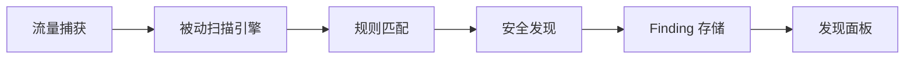
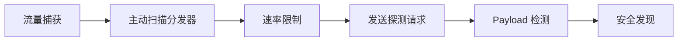

# 插件

插件是 FlowMind 的安全检测核心，所有扫描规则和标签脚本都在此管理。插件页面分为三个标签页：**规则**（被动扫描）、**扫描**（主动扫描）和**标签**（请求标签脚本）。


## 功能概述

- **规则管理**：查看、创建、编辑、删除被动扫描规则脚本
- **扫描管理**：查看、创建、编辑、删除主动扫描规则脚本
- **标签脚本**：编写 Rhai 函数，为请求自动添加标签
- **热重载**：修改脚本后一键重载，无需重启应用
- **规则调试**：选中 Flow 调试规则执行结果
- **项目配置**：按项目启用/禁用规则

## 页面布局

插件页顶部有三个标签页切换：

| 标签 | 说明 |
|------|------|
| **规则** | 被动扫描脚本管理（`plugins/scanner/passive/`） |
| **扫描** | 主动扫描脚本管理（`plugins/scanner/active/`） |
| **标签** | 标签脚本管理 |

## 规则（被动扫描）

被动扫描规则的编辑与管理界面。规则以 `.rhai` 文件形式存储在 `plugins/scanner/passive/` 目录。

### 规则列表

- **内置规则**：编译集成，首次启动自动释放，只读不可编辑
- **工作区规则**：用户创建，可编辑、删除、重命名
- **状态指示**：显示规则是否已启用、元数据信息

### 操作

| 操作 | 说明 |
|------|------|
| 启用/禁用 | 切换规则启用状态 |
| 编辑 | 打开脚本编辑器修改规则 |
| 创建 | 在工作区创建新的规则文件 |
| 删除 | 删除工作区规则 |
| 重载 | 重新加载所有脚本文件 |
| 调试 | 选中 Flow 后调试规则输出 |

### 执行流程



被动扫描在流量捕获时自动触发，无需人工干预。规则对所有 HTTP/HTTPS 和 WebSocket 流量进行安全检查，发现结果自动存入 Finding 存储，可通过状态栏的发现面板或报告页面查看。

### 内置规则

内置 28 条被动扫描规则，默认全部启用，覆盖 OWASP Top 10 常见风险。完整规则列表见下方。

## 扫描（主动扫描）

主动扫描规则的管理界面。规则以 `.rhai` 文件形式存储在 `plugins/scanner/active/` 目录。

### 执行流程



主动扫描在流量捕获时自动并发执行（默认关闭，需在项目中启用），对目标发送探测请求。

### 内置规则

内置 8 条主动扫描规则，默认全部关闭，需在项目中显式启用。

## 标签脚本

标签脚本是使用 Rhai 语言编写的函数，用于为捕获的请求自动添加标签。

### 用途

- **端点分类**：根据 URL 模式标记 API 端点类型
- **敏感操作标记**：识别并标记涉及敏感操作的请求
- **技术栈识别**：根据响应头标记技术栈信息
- **自定义标注**：按项目需求自定义标签逻辑

### 函数格式

标签脚本导出 `fn tag(flow)` 函数，返回字符串数组作为标签：

```rust
fn tag(flow) {
    let tags = [];
    if host_url_match(flow, "/api/admin") {
        tags.push("admin");
    }
    if host_url_match(flow, "(?i)(login|auth|token)") {
        tags.push("auth");
    }
    if host_header_absent(flow, "req", "authorization") {
        tags.push("no-auth");
    }
    tags
}
```

### 示例标签脚本

```rust
//! name: API 端点分类
//! description: 根据路径和方法分类 API 端点

fn tag(flow) {
    let tags = [];
    let method = flow.method;
    let url = flow.url;

    // 按方法分类
    if method == "GET" { tags.push("read"); }
    if method == "POST" { tags.push("write"); }
    if method == "DELETE" { tags.push("delete"); }
    if method == "PUT" || method == "PATCH" { tags.push("update"); }

    // 按路径分类
    if host_url_match(flow, "/api/") { tags.push("api"); }
    if host_url_match(flow, "(?i)(admin|manage)") { tags.push("admin"); }
    if host_url_match(flow, "(?i)(login|logout|signin|signout)") { tags.push("auth"); }

    // 按状态码分类
    if flow.status_code >= 500 { tags.push("server-error"); }
    if flow.status_code >= 400 && flow.status_code < 500 { tags.push("client-error"); }

    tags
}
```

## 脚本编辑器

所有规则和标签脚本共享同一个编辑器界面，支持：

- **语法高亮**：Rhai 脚本语法高亮
- **代码折叠**：折叠/展开代码块
- **错误提示**：编译错误实时显示
- **调试输出**：执行结果预览

## 项目配置

- 进入 **设置** → **项目设置** 可为当前项目启用/禁用规则
- 主动规则默认关闭，需在项目中显式启用
- 规则配置按项目保存，切换项目自动切换配置

## 查看发现

扫描发现的 Finding 可通过以下方式查看：

- **状态栏发现面板**：点击状态栏的发现图标，快速查看最近的发现
- **报告页面**：在报告的 **发现** 标签页中浏览和管理所有发现

具体操作详见 [报告 → 发现管理](./reports.md#finding-管理)。

## 内置规则列表

### 被动规则（28 条，默认全部启用）

| 规则 ID | 名称 | 检测内容 | 严重程度 |
|---------|------|----------|----------|
| `sensitive-data` | 敏感信息泄露 | 手机号、身份证、邮箱、密钥等 | High |
| `credit-card` | 信用卡号泄露 | Visa/MasterCard/Amex 卡号 | High |
| `transport-http-sensitive` | HTTP 明文敏感参数 | 明文传输 password/token/secret | High |
| `transport-hsts-missing` | HSTS 缺失 | HTTPS 响应缺少 HSTS 头 | High |
| `certificate` | 服务端证书问题 | 证书自签名或已过期 | High |
| `sqli-pattern` | SQL 注入模式 | UNION SELECT、OR 1=1 等特征 | High |
| `path-traversal` | 路径遍历模式 | ../ 或 ..\\ 路径穿越 | High |
| `api-key-in-url` | URL 暴露 API Key | URL 查询参数含 api_key 等 | High |
| `websocket-ws-sensitive` | WebSocket 明文敏感信息 | ws:// 传输 password/token | High |
| `websocket-ws-plaintext` | WebSocket 明文连接 | ws:// 明文协议连接 | High |
| `cookie-security` | Cookie 安全属性缺失 | 缺少 HttpOnly/Secure/SameSite | Medium |
| `cors` | CORS 配置不安全 | ACAO: \* + ACAC: true | Medium |
| `csp` | CSP 配置宽松 | unsafe-inline、unsafe-eval、\* | Medium |
| `x-frame-options` | X-Frame-Options 缺失 | 可能被嵌入 iframe 点击劫持 | Medium |
| `jwt-token` | JWT Token 泄露 | 响应体包含 eyJ 开头的 JWT | Medium |
| `stack-trace` | 堆栈跟踪泄露 | 响应包含调试堆栈信息 | Medium |
| `debug-page` | 调试页面暴露 | Flask debug、PHPInfo、Spring Boot 错误页 | Medium |
| `directory-listing` | 目录列表暴露 | Index of / 目录列表 | Medium |
| `open-redirect` | 开放重定向 | Location 指向外部域名的 3xx | Medium |
| `host-header-injection` | Host 头注入 | 响应反射请求的 Host 头 | Medium |
| `xss-reflection` | XSS 反射模式 | 未编码的 \<script\> 或事件处理器 | Medium |
| `content-type` | Content-Type 安全头缺失 | 缺少 X-Content-Type-Options | Low |
| `info-leak` | 服务器信息泄露 | Server/X-Powered-By 等技术栈头 | Low |
| `internal-ip` | 内网 IP 泄露 | 响应含 RFC1918 内网 IP 地址 | Low |
| `referrer-policy` | Referrer-Policy 缺失 | 缺少 Referrer-Policy 头 | Low |
| `permissions-policy` | Permissions-Policy 缺失 | 缺少权限控制策略头 | Low |
| `cache-control` | Cache-Control 缺失 | 敏感页面缺少缓存控制头 | Low |
| `x-xss-protection` | X-XSS-Protection 缺失 | 缺少 XSS 过滤头（兼容旧浏览器） | Low |

### 主动规则（8 条，默认全部关闭）

| 规则 ID | 名称 | 检测方式 | 严重程度 |
|---------|------|----------|----------|
| `active-sqli-error` | 主动 SQL 注入（报错） | 追加引号 payload，检测数据库错误特征 | High |
| `active-cmd-injection` | 主动命令执行 | 追加 echo canary，检测回显 | High |
| `active-path-traversal` | 主动路径穿越 | 替换为 ../etc/passwd payload | High |
| `active-ssrf` | 主动 SSRF | 注入内网地址，检测连接失败或元数据特征 | High |
| `active-xss-reflect` | 主动 XSS 反射 | 追加唯一探测标记，检测响应回显 | Medium |
| `active-open-redirect` | 主动开放重定向 | 注入外部探测域名，检测 Location 跳转 | Medium |
| `active-ssti` | 主动模板注入 | 追加算术表达式，检测求值结果 | Medium |
| `active-error-disclosure` | 主动异常信息泄露 | 注入畸形输入，对比基线检测堆栈变化 | Low |

## 插件开发

所有扫描规则使用 **Rhai 脚本** 语言编写。详见：

- [Rhai 脚本规则开发](../dev/plugins/rhai.md) — 编写自定义规则
- [声明式插件开发](../dev/plugins/declarative.md) — 简单的模式匹配规则

## 故障排除

### 规则不触发

1. 检查规则是否在项目中启用
2. 确认代理正在运行且捕获到流量
3. 被动规则在请求完成后自动触发，主动规则在有流量时运行
4. 查看日志中的扫描信息

### 脚本加载失败

1. 检查 `.rhai` 文件格式和语法
2. 确认元数据头（`//!`）格式正确
3. 查看应用日志中的编译错误信息
4. 点击 **重载** 刷新

### 性能问题

1. 减少同时启用的规则数量
2. 在脚本中尽早 return 以减少不必要的正则匹配
3. 调整主动扫描的并发限制
4. 定期清理历史 Flow 数据
