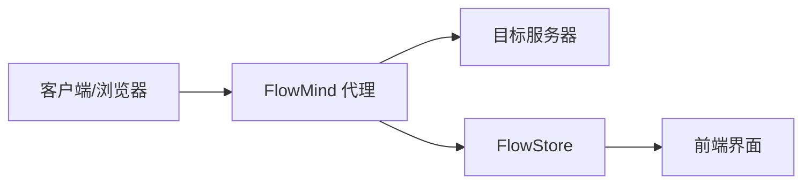

# 代理核心

FlowMind 内嵌了基于 Rust 的 MITM（中间人）代理引擎，支持 HTTP/HTTPS/WebSocket 流量捕获。

## 代理架构

## 启动与停止

### 启动代理

1. 点击标题栏的 **启动代理** 按钮
2. 代理开始监听配置的地址和端口
3. 状态栏显示：`● 代理运行中 - 127.0.0.1:8080`

### 健康信息

代理运行时会显示以下健康指标：

| 指标 | 说明 |
|------|------|
| 活跃连接数 | 当前正在处理的连接数量 |
| 总请求数 | 自代理启动以来的总请求数 |

## 配置选项

进入 **设置** → **代理配置** 可以调整以下选项：

| 配置项 | 默认值 | 说明 |
|--------|--------|------|
| 监听地址 | `127.0.0.1` | 代理监听的 IP 地址 |
| 监听端口 | `8080` | 代理监听的端口号 |
| 最大请求体大小 | `10 MB` | 单个请求体的最大大小 |
| 最大 WebSocket 消息大小 | `1 MB` | WebSocket 消息的最大大小 |

::: tip 端口冲突
如果配置的端口已被占用，代理会自动尝试使用其他端口，并在状态栏显示实际使用的端口。
:::

## HTTPS MITM

### 工作原理

1. 客户端发起 HTTPS 连接到代理
2. 代理动态生成目标域名的证书
3. 代理与客户端建立 TLS 连接
4. 代理与目标服务器建立 TLS 连接
5. 代理解密、记录、重新加密流量

### CA 证书管理

| 操作 | 说明 |
|------|------|
| 导出 CA 证书 | 将 CA 证书导出为文件，用于安装到客户端 |
| 重新生成 CA | 生成新的 CA 密钥对（旧证书将失效） |
| 查看 CA SPKI | 显示证书的 SPKI 哈希，用于证书固定 |

## WebSocket 支持

FlowMind 完整支持 WebSocket 协议：

- **连接捕获**：自动识别 WebSocket 升级请求
- **消息记录**：记录所有 WebSocket 消息（文本/二进制）
- **关闭帧**：记录 WebSocket 连接关闭信息
- **详情查看**：在转发器详情面板的 WebSocket 标签页查看

## 协议支持

| 协议 | 状态 | 说明 |
|------|------|------|
| HTTP/1.0 | ✅ 完全支持 | |
| HTTP/1.1 | ✅ 完全支持 | |
| HTTPS | ✅ 完全支持 | 通过 MITM 解密 |
| WebSocket | ✅ 完全支持 | 包括 WSS |
| HTTP/2 | ⚠️ 部分支持 | 当前以 HTTP/1 路径为主 |

## 故障排除

### 代理无法启动

1. **端口被占用**：更改监听端口或关闭占用端口的程序
2. **权限不足**：Linux/macOS 下 1024 以下端口需要 root 权限
3. **防火墙拦截**：检查防火墙设置

### HTTPS 解密失败

1. **CA 证书未安装**：导出并安装 CA 证书
2. **证书固定**：目标应用使用证书固定时无法解密
3. **双向 TLS**：需要客户端证书的场景暂不支持

### 性能问题

1. **大量连接**：调整最大连接数配置
2. **大文件**：增加请求体大小限制
3. **内存占用**：定期清理 Flow 数据
