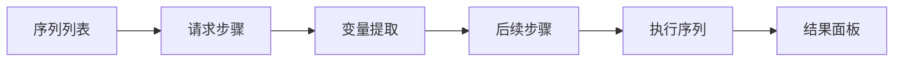

# 序列器

序列器用于将多个请求按顺序编排执行，支持从上一步响应中提取数据并传递给后续请求，适合测试多步骤业务逻辑与复杂 API 工作流。


## 功能概述

- **多步骤编排**：将多个请求按顺序排列执行
- **变量提取**：从响应中提取 Token、ID 等数据
- **变量传递**：将提取结果注入后续请求的参数、头或请求体
- **条件控制**：支持基于响应结果的执行判断
- **导入导出**：从重发器、代理流量导入请求，或导出序列

## 界面布局

序列器以序列为编辑单元，每个序列包含按顺序排列的请求步骤：



## 创建序列

1. 在序列器页面点击 **新建序列**
2. 输入序列名称（如"注册-登录-下单"）
3. 按业务顺序添加请求步骤

### 添加请求步骤

- 右键转发器中的请求 → **发送到序列器**
- 右键重发器标签 → **发送到序列器**
- 在序列中点击 **+** 手动创建

## 变量提取与传递

### 提取变量

每个步骤执行后可提取响应中的值：

| 来源 | 示例 |
|------|------|
| 响应头 | `Set-Cookie` 中的 Session ID |
| 响应体 | JSON 字段如 `data.token` |
| 正则提取 | 自定义正则捕获片段 |

### 引用变量

在后续步骤中以 `{{变量名}}` 形式引用：

```
POST /api/order HTTP/1.1
Host: example.com
Authorization: Bearer {{token}}
Content-Type: application/json

{"productId": 1, "quantity": 2}
```

## 执行序列

1. 点击 **执行** 按钮（或 `Ctrl/⌘ + Enter`）
2. 按步骤顺序自动发送请求
3. 每一步结果展示在结果面板

### 执行选项

| 选项 | 说明 |
|------|------|
| 循环次数 | 重复执行整个序列 |
| 暂停间隔 | 步骤之间的等待时间（ms） |
| 失败即停 | 某步骤失败后停止后续执行 |

## 查看结果

结果面板按步骤展示：

- 请求与响应报文
- 状态码、响应时间
- 提取的变量值
- 步骤执行顺序与耗时

## 导入导出

支持将序列导出为 JSON 文件，或从 JSON 导入复用；也可直接发送到[模糊器](./fuzzer.md)进行多步骤工作流模糊测试。

## 使用场景

### 多步骤业务流测试

```
1. 捕获登录请求
2. 提取响应中的 Token
3. 将 Token 注入后续业务请求
4. 按顺序执行完整业务流
5. 验证越权或逻辑缺陷
```

### 权限链验证

```
1. 序列步骤覆盖 创建 → 查看 → 修改 → 删除
2. 对比不同用户角色下各步骤的访问结果
3. 识别水平/垂直越权
```

### 环境切换验证

```
1. 配置不同环境的 Host
2. 同一序列在不同环境执行
3. 对比各步骤响应差异
```

## 快捷键

| 快捷键 | 功能 |
|--------|------|
| `Ctrl/⌘ + Enter` | 执行序列 |
| `Ctrl/⌘ + N` | 新建序列 |
| `Ctrl/⌘ + S` | 保存序列 |
| `Ctrl/⌘ + W` | 关闭当前序列 |
